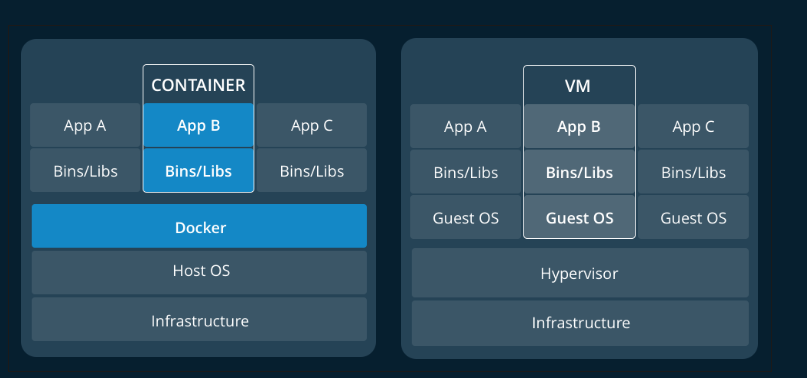

**Docker使用指南**

---

1.  [创建Docker环境](# 创建Docker环境)
2.  [制作镜像并作为容器运行](# 制作镜像并作为容器运行)
3.  [开发环境下设置和使用Kubernates](# 开发环境下设置和使用Kubernates)
4.  [开发环境下设置和使用Swarm](# 开发环境下设置和使用Swarm)
5.  [在Dcoker Hub上共享容器化应用](# 在Dcoker Hub上共享容器化应用)

---

#### 创建Docker环境

1.  docker概念

   docker时给开发人员和系统管理员设置的平台,使用容器构建,分享,和组件的应用.容器使用者部署应用称作**容器化**.容器不是新的,但是他们对于简单部署的应用是新的.

   容器化变得越来越流行是因为:

   +  灵活性: 最复杂的应用都可以被容器化
   +  轻量级: 容器的杠杆作用(leverage)且共享主机内核.从系统资源的角度来说是比**虚拟机**更加的高效.
   +  可携带性: 你可以本地构建,发布到云端,且可以在任何地方运行.
   +  松耦合: 容器具有高度的自效性和密封性.允许在不影响其他容器的情况下允许你去替代和更新它们.
   +  高度伸缩性(scalable): 通过数据中心可以增加或者自动分配容器的副本.
   +  安全性:  容器使用竞争性的限制和隔离措施,使得不需要任何用户端的配置即可允许.

2.  镜像和容器

   从根本上来说,容器仅仅是一个运行的进程,这个进程进行了协议密封措施,主要是为了保证其和其他容器或者主机的**隔离性**.

   容器最重要的隔离措施是,每个容器与它自有的私用文件系统进行交互.docker提供的这种文件系统叫做**镜像**.一个镜像中包含运行任务的所有内容.包括代码,运行时参数,依赖以及其他文件系统对象.

3.  容器和虚拟机(VM)

   容器本地运行在linux上,与其他容器共享主机的内核.运行一个非连续的进程,花费的内存不超过其他可执行应用,使得其轻量化.

   相反的,虚拟机(VM)使用虚拟化运行一个成熟的客户操作系统,通过管理程序获取主机资源.总体来说,虚拟机在运行用户的逻辑应用时,产生了很多开销.

   

4.  编制(Orchestration)

   容器化进程的便携性和可重塑性意味着我们可以移动或者扩大容器化的应用,通过数据中心或者云端.容器高效的保证了这些应用会以相同的方式运行在不同的地方.允许我们快速便捷的使用它们的环境.此外,当我们扩充应用时,需要一些工具去自动维护这些应用,能够自动替换失败的容器,管理更新的部署,在生命周期内部重新配置这些容器.

   用于管理,扩大,和维护容器化应用的工具称作**编制**(Orchestration),通用的两个工具就是Kubernetes和Docekr Swarm. 开发环境通过Docker Destop部署这些编制.这个过程中使用这个编制去创建首个参与编制的容器化应用.

5.  安装docker桌面版本

   启动开发容器化应用的最好范式就是使用Docker Destop,对于OSX和windows系统.桌面工具可以简易的安装k8s和swarm在你本机的开发环境上.你能够使用立刻使用开发应用的编制功能.并不需要集群的参与.安装指导:

   +  [OSX](# https://docs.docker.com/docker-for-mac/install/)
   +  [Windows](# https://docs.docker.com/docker-for-windows/install/)

   

6.  启动Kubernetes

   docker左面可以简单快速的安装K8S,这里只介绍windows系统的

   +  安装完毕docker的桌面工具后,右击图标,选择**Settings -> Kubernetes**.

   +  检查复选框是否*Enable Kubernetes*,点击**Apply**,桌面客户端就会自动的按照k8s.注意这需要大量的时间(20min).安装完成之后点击菜单栏,点击setting,就可以看到一个绿点: ‘Kubernetes is running’.

   +  创建一个pod.yaml去确认k8s已经开始运行.内容如下:

     ```yaml
     apiVersion: v1
      kind: Pod
      metadata:
        name: demo
      spec:
        containers:
        - name: testpod
          image: alpine:3.5
          command: ["ping", "8.8.8.8"]
     ```

     这里描述了单个容器的pod,隔离地址为8.8.8.8

   +  创建pod

     ```shell
      kubectl apply -f pod.yaml
     ```

   +  检查你的pod是否允许起来了

     ```shell
      kubectl get pods
     ```

     你会看到下面的内容

     ```shell
      NAME      READY     STATUS    RESTARTS   AGE
      demo      1/1       Running   0          4s
     ```

   +  检查日志

     ```shell
     kubectl logs demo
     ```

     你可以看到如下内容

     ```shell
      PING 8.8.8.8 (8.8.8.8): 56 data bytes
      64 bytes from 8.8.8.8: seq=0 ttl=37 time=21.393 ms
      64 bytes from 8.8.8.8: seq=1 ttl=37 time=15.320 ms
      64 bytes from 8.8.8.8: seq=2 ttl=37 time=11.111 ms
      ...
     ```

   +  最后删除掉测试pod

     ```shell
     kubectl delete -f pod.yaml
     ```

7.  启动docker Swarm

   这里只介绍windows版本安装

   +  初始化swarm模式

     ```shell
      docker swarm init
     ```

   +  执行成功,你可以看到下述类型信息

     ```shell
     Swarm initialized: current node (tjjggogqpnpj2phbfbz8jd5oq) is now a manager.
      To add a worker to this swarm, run the following command:
          docker swarm join --token SWMTKN-1-3e0hh0jd5t4yjg209f4g5qpowbsczfahv2dea9a1ay2l8787cf-2h4ly330d0j917ocvzw30j5x9 192.168.65.3:2377
      To add a manager to this swarm, run 'docker swarm join-token manager' and follow the instructions.
     ```

   +  运行简单的docker服务,使用alpine-based文件系统

     ```shell
      docker service create --name demo alpine:3.5 ping 8.8.8.8
     ```

   +  检查运行配置

     ```shell
      docker service ps demo
     ```

     可以看到如下内容

     ```shell
     ID                  NAME                IMAGE               NODE                DESIRED STATE       CURRENT STATE           ERROR               PORTS
      463j2s3y4b5o        demo.1              alpine:3.5          docker-desktop      Running             Running 8 seconds ago
     ```

   +  检查日志

     ```shell
     docker service logs demo
     ```

     可以看到如下日志

     ```shell
     demo.1.463j2s3y4b5o@docker-desktop    | PING 8.8.8.8 (8.8.8.8): 56 data bytes
      demo.1.463j2s3y4b5o@docker-desktop    | 64 bytes from 8.8.8.8: seq=0 ttl=37 time=13.005 ms
      demo.1.463j2s3y4b5o@docker-desktop    | 64 bytes from 8.8.8.8: seq=1 ttl=37 time=13.847 ms
      demo.1.463j2s3y4b5o@docker-desktop    | 64 bytes from 8.8.8.8: seq=2 ttl=37 time=41.296 ms
      ...
     ```

   +  删掉测试服务

     ```shell
     docker service rm demo
     ```

#### 制作镜像并作为容器运行

1.  介绍

   既然在开发环境中,以及获取了编制工具.我们就可以开始开发容器化应用了.总体来说,开发工作流如下:

   >1.  首次创建镜像时,创建你的应用每个组件的测试容器
   >2.  组装你的容器,支持基础设置到一个完成的应用中,可以使用Dcoker Stack File或者 K8S YAML来表述.
   >3.  测试,共享和发布你已经完成的容器化应用.

   在这里,关注工作流的第一步,创建容器基于的镜像.记住,docker镜像捕捉私有文件系统.我们的容器化进程就会运行在这个文件系统上.所以我们只需要创建一个镜像,这个镜像仅仅包含应用需要运行的资源即可.

   > 一旦你学会了如何端构建镜像,容器化的开发环境很容易搭建.因为容器化开发环境会隔离所有依赖,这些依赖是你的程序需要的且在docker镜像中.这种情况下,你能简单的开发不同类型的应用,而不用改变开发机器上的环境.

2. 创建

   +  克隆一个示例项目

     ```shell
     git clone -b v1 https://github.com/docker-training/node-bulletin-board
     cd node-bulletin-board/bulletin-board-app
     ```

     ：这是一个简单的看板程序,使用node.js写的.示例中,你不需要对它容器化,开始想象你写的app.

   +  看看文件的DockerFile,这个文件描述了如何去组装文件系统,你也可以加入一些元数据,用于描述在镜像中如何去运行容器.这个App的Dockerfile如下

     ```dockerfile
     FROM node:6.11.5    
     
     WORKDIR /usr/src/app
     COPY package.json .
     RUN npm install    
     COPY . .
     
     CMD [ "npm", "start" ]    
     ```

     写Dockerfile的第一步时去对应用进行容器化.你可以考虑这些指令一步一步执行,内容是关于如何构建镜像.这个任务包含如下几步:

     ```dockerfile
     # 获取node:6.11.5的镜像,这是一个官方镜像,使用nodeJs构建.进过docker验证,成为一个高质量的镜像,包含node:6.11.5 和一些基本的依赖
     FROM node:6.11.5    
     # WORKDIR 指定子动作来自于的目录位置为映像文件系统目录 /usr/src/app(不是主机的文件系统)
     WORKDIR /usr/src/app
     # 拷贝文件 package.json 到你主机映像当前位置(.)[这种情况下为/usr/src/app/package.json]
     COPY package.json .
     # 在你的镜像文件系统中安装依赖
     RUN npm install    
     # 拷贝应用中其他源码,从主机拷贝到镜像文件系统中
   COPY . .
     
     CMD [ "npm", "start" ]    
     ```
     
     你可注意到这些大多都是相同的步骤(与你在主机上操作和安装的步骤).但是使用dockerfile可以允许我们去做同样的事情在一个可移动的,相互隔离的docker镜像中.
     
     上述步骤组件了镜像的文件系统.大叔还有最后一条命令.CMD指令是第一个指定元数据信息到镜像中的指令.描述了如何基于这个镜像运行容器.在这种情况下,镜像下容器化进程意味着支持`npm start` 指令.
     
     上述值组件dockerfile的简单例子,总是以`FROM` 指令开头,下面就是用于描述你新建的私有文件系统信息,且包含溢写需要指定的元数据信息.更多的docker指令,请参考: [docker指令](# https://docs.docker.com/engine/reference/builder/)

3. 构建和测试镜像

   既然以及有源码和docker文件.这时候就可以构建第一个镜像了,确保容器运行在正常状态下.

   以看板程序为示例:

   +  确保你在目录`node-bulletin-board/bulletin-board-app` 下,使用终端工具,构建镜像

     ```shell
     docker image build -t bulletinboard:1.0 .
     ```

     你可以看到dockerfile中每条指令的执行过程信息,如果成功则会看到如下信息

     ``Successfully tagged bulletinboard:1.0`.`

     注意: windows用户在这一步会受到安全警告信息(显示的是你没有对指定文件的权限).这个示例中忽视这个信息.

   +  在镜像下运行容器

     ```shell
     docker container run --publish 8000:8080 --detach --name bb bulletinboard:1.0
     ```

     在这里使用下列标记:

     > +  --publish : 将主机的8000端口迁移到容器的8000端口(容器具有自己的端口集合)
     > +  --detach : 询问docker是否后台运行容器
     > +  --name : 指定名称为bb(这条指令)

   +  浏览器访问`localhost:8000` .你就可以看到看板程序运行的情况,这一步我们需要保证容器运行正常,现在,就可以有时间运行单元测试了.

   +  当你觉得运行的没问题,就可以删除这个容器了

     ```shell
     docker container rm --force bb
     ```

#### 开发环境下设置和使用Kubernates

+ 前置需求：

1.  进行完毕docker上k8s的安装
2.  确保k8s在docker destop上可以使用

+ 介绍：

既然证明了单个应用组件可以运行在独立的容器上。通过使用编制工具K8s对其进行关，k8s提供许多扩容，网络，安全和维护应用的工具（远远超过容器本身的能力）。

为了去证实反序列化应用在k8s上也能使用，在k8s集群上处理应用前，我们使用DockerDestop的k8s环境去部署应用。dockerDestop上的k8s环境是完全特征化的，意味着k8s将你的应用特征化，应用会到一个真实的集群环境。可以获得开发机器上的便利条件。

+ 使用Kubernetes YAML描述应用

所有k8s的容器按照**pods**形式进行调度，这是一组享有共同资源的协调工作容器。进一步看，实际应用不会创建个体**pods**。相反大多数的工作负载按照部署进行调度，这个是由k8s维护的可以扩展的，自动维护的**pods**组。最后，所有的k8s对象应当在k8s YAML文件描述配置清单信息。YAML文件描述组件和k8s应用配置信息，这些配置能够简单地创建和销毁k8s环境中的应用。

1.  在第一份文档中你已经写了一个基本的k8s YAML文件，这下来尝试一个更加复杂的情况，记下一个文件为`bb.yaml`:

   ```yaml
   apiVersion: apps/v1
   kind: Deployment
   metadata:
     name: bb-demo
     namespace: default
   spec:
    # 副本数量配置
     replicas: 1 
     selector:
       matchLabels:
         bb: web
     # 副本信息
     template:
       metadata:
         labels:
           bb: web
       spec:
       # 指定容器镜像信息
         containers:
         - name: bb-site
           image: bulletinboard:1.0
   ---
   apiVersion: v1
   kind: Service
   metadata:
     name: bb-entrypoint
     namespace: default
   spec:
     type: NodePort
     selector:
       bb: web
     ports:
     - port: 8080
       targetPort: 8080
       nodePort: 30001
   ```

   在这个YAML文件了,存在有两个对象,由--- 分割

   +  第一个名称为Deployment,描述了一个可以扩展的pods,在这种情况下,你可以获取一个副本.且那个pods(描述诶template)有一个运行的容器,基于 bulletinboard:1.0
   +  第二个名称为NodePort服务,会占用主机30001端口(使用pods内部路由定位到8080端口),这样可以同个这个端口访问公告板页面.

   同时也需要注意到yaml文件可以添加长且复杂的信息,包括如下几个类型:

   +  `apiVersion`:  包含指示k8s API需要转换的对象
   +  `kind`: 指示对象的类型
   +  `metadata`: 对象的名称
   +  `spec`: 指定配置对象的参数列表

+  部署和检查你的应用情况

  1.  在终端中指定编写的`bb.yaml`文件,部署应用到k8s上

     ```shell
     kubectl apply -f bb.yaml
     ```

     可以看到下面类似的输出,表示你的k8s对象创建成功

     ```shell
     deployment.apps/bb-demo created
     service/bb-entrypoint created
     ```

  2.  确认部署的工作列表

     ```shell
     kubectl get deployments
     ```

     如果全部都工作正常,显示类似如下信息:

     ```shell
     NAME      DESIRED   CURRENT   UP-TO-DATE   AVAILABLE   AGE
     bb-demo   1         1         1            1           48s
     ```

     这个表示所有在YAML中配置的pods正在运行中.同样的做法去确认`services`

     ```shell
     kubectl get services
     
     NAME            TYPE        CLUSTER-IP       EXTERNAL-IP   PORT(S)          AGE
     bb-entrypoint   NodePort    10.106.145.116   <none>        8080:30001/TCP   53s
     kubernetes      ClusterIP   10.96.0.1        <none>        443/TCP          138d
     ```
     这里我们可以看到访问端口在30001.
     
  3.   打开浏览器访问`localhost:30001`端口.你应当可以看到公告板的页面.
  
  4.   删除部署
  
      ```shell
      kubectl delete -f bb.yaml
      ```

#### 开发环境下设置和使用Swarm

暂时不更新这个文档内容

#### 在Dcoker Hub上共享容器化应用

这里主要介绍在docker hub上发布镜像.

1.  操作需求

   在DockerDestop上部署了k8s.

2.  介绍

   所有操作的最后一步,就是部署容器化应用,将其分享镜像到DockerHub中.以便可以很方便的下载和运行在任意目标集群中.

3.  创建DockerHub账户

4.  创建和推送到DockHub库中

   这里你已经创建DockerHub账号,现在开始创建第一个库,在这里会分享公告板app.

   +  点击Docker桌面图标,找到**Repositories** -> **Create**,会进入DockerHub页面,去创建一个新的库.

   +  找到`bulletinboard` 的库,先不考虑其他配置,直接点击底部的创建

   + 现在就可以共享镜像到DockerHub上了,但是现在有一样事情必须要去做,镜像必须在DockerHub中正确命名,形如`<Docker Hub ID>/<Repository Name>:<tag>`,现在对docker的名称进行重新标记:

     ```shell
     docker image tag bulletinboard:1.0 gordon/bulletinboard:1.0
     ```

   + 最后,将镜像推送到DockerHub上

     ```shell
     docker image push gordon/bulletinboard:1.0
     ```

   这时候就可以访问DockerHub了,你可以看到你的新镜像,默认情况下库时公有的.