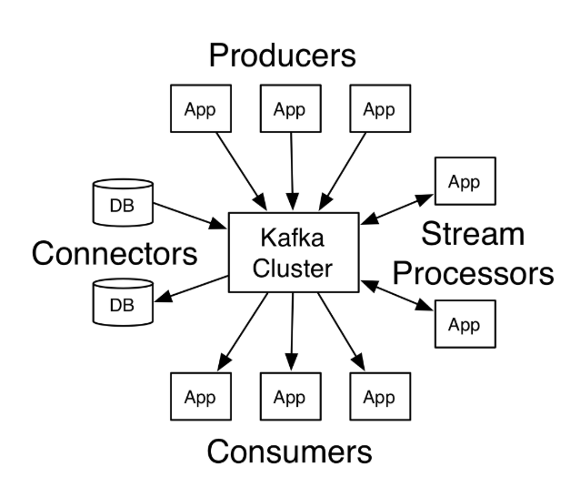

#### 介绍

kafka是一个分布式流式平台。

流式平台有三个关键功能

+ 发布和订阅流式记录，类似于消息队列或者企业的消息系统
+ 以默认持久化的方式存储流式记录
+ 处理流式记录

kafka用于两种类型的应用

+ 构建实时流式数据的pipeline，可以从系统或者应用中可靠的获取数据
+ 构建实时流式应用，这个对流式数据进行转换或者响应

为了理解kafka处理这些问题的原理，现在从底层去讨论kafka的功能。

首先给出下述概念:

+ kafka以集群的形式运行,一个/多个服务器可以跨越多个数据数据中心
+ kafka集群存储流式记录到topic中
+ 每条记录包含key/value和时间戳信息

kafka包含如下四个核心概念

+ 生产者API允许应用发布流式数据到一个或者多个topic中
+ 消费者API允许应用订阅一个或者多个topic,并且生成流式记录去消费

- Stream API允许应用作为流式处理器,消费一个/多个topic的输入流,且对于一个/多个topic生成输出流,高效地将输入流转换成输出流中.
- Connector API 允许构建和运行可重用的生产者或者消费者.可以连接kafka到存在的应用或者数据系统上.例如,可以连接到相关的数据库.可以捕捉数据库的变化。

在kafka的通信中，客户端和服务端的通信使用了简单高性能的TCP协议。这个协议具有兼容性。这里提供kafka的java客户端，其实kafka其他了其他语言的客户端。



#### Topic和日志

这个topic是一个目录,用于放置记录发布位置的名称.kafka中的topic有多个订阅者.

一个topic有0,1或者多个消费者,这些消费者会订阅写入到topic的数据.

每个topic中,kafka集群会维护一个分区日志.


每个分区都是经过排序的,记录的不变序列会被不断地添加到一个结构化的提交日志中. 这些分区记录拥有一个序列ID编号,这个叫做**offset**, 这个会唯一标识分区中的每条记录.

kafka集群持久化所有发布的记录,无论是否有消费掉(使用给定的**保留周期**). 

> 例如,如果存留策略设置为2天.在记录发布两条之后,就可以消费了,在被弃用之后就会释放相应的空间.
>
> kafka的性能在一段较长的时间内,保证一定数据量的性能可以得到保证.


实际上,仅仅元数据会保留在每个消费者上,这个元数据是日志中消费者的**offset**.这个offset由消费者控制.正常情况下,消费者会随着记录的读取,线性地增加offset.但是实际上,由于位置由消费者控制,因此可以消费任意顺序的记录.例如,消费者可以重置到旧的offset,**用于重新处理过去的或者最近跳过消费的记录.**

这些功能意味着kafka消费者是非常廉价的,因为可以会对集群或者其他消费者产生影响.例如,可以使用命令行工具去获取topic内容的默认内容.且不需要改变当前消费者的消费情况.

> 日志中的分区用于多个目标.
>
> 首先,允许日志的扩展.用于适应单台服务器.每个分区必须符合对应的服务器.但是topic有多个分区,所以可以出了任意数量的数据.
>
> 其次,可以作为并行消费的基本单位.

#### 分布式

日志分区是分布式的.kafka集群的每台服务器处理或者请求共享分区的数据.每个分区通过服务器配置参数进行副本设置.用于实现容错.

每个分区都有一个分区,这个分区叫做leader.和0/多个服务器,这些服务器叫做follower.

leader会处理所有分区读写请求.而follower会被动地对leader进行备份.

如果leader失败,其中一个follower会自动变成新的leader.

每个服务器作为一个leader和多个分区的follower,这样做用于集群的负载均衡.

#### 异地备份

kafka的**MirrorMaker**提供集群的异地备份。使用**MirrorMaker**，消息可以通过多个数据中心或者云进行备份。可以使用主动/被动脚本用于备份或者回复.在主动/被动脚本中,会使用靠近用户的数据,或者支持本地需求的数据.

#### 生产者

生产者发布数据到topic中.生产者决定哪些记录会被分派到topic中的哪些分区中.可以使用**round-robin**简单地进行负载均衡.或者可以通过一些**语义分区函数**进行负载均衡.

#### 消费者

消费者使用**消费者组**进行标签.且每条发布到topic中的**记录** 会被分发到**每个订阅消费组**中的**一个消费者**.

消费者实例可以处于不同机器的不同进程中.

> **两种极端情况：**
>
> 如果所有消费者实例都有相同的消费者组,那么这条记录可以高效地进行负载均衡.
>
> 如果所有消费者实例有不同的消费者组,每条记录会广播到所有消费者进程中.


一个两台服务器的kafka集群,持有四个分区(P0-3).使用了两个消费者组.消费者组A有2个消费者.消费者组B有4个消费者实例.

通常来说,对于每个逻辑订阅者,每个组由多个消费者组成,用于进行扩展和容错.除了有发布订阅的语义之外,没有其他的功能.

kafka的消费方式通过划分日志中的分区实现.以便于每个消费者实例都是他的消费者.**维护消费者组的进程**由**kafka协议**动态处理.如果新的消费者实例加入了消费者组,会从消费者组获取一些分区.如果消费者实例死亡,分区会被分给其他消费者实例.

kafka仅仅提供**分区内的全局顺序**,不是一个topic中的其他分区/每个分区排序可以按照key进行高效排序.但是,如果需要记录的全局排序,可以在topic中仅仅设置一个分区.但是意味着仅仅一个消费者可以处理.

#### 多重租用技术

kafka的部署可以使用多重租用技术. 通过生成或者消费数据的topic,启动多重租用. 管理员可以定义和实现定额,用于申请和控制客户端使用的broker资源.

#### 保证

kafka给出了下述保证

+ 生产者发送的消息可以按照顺序添加到分区中。如果M1和记录M2通过相同的生产者发送，M1首先发送，那么M1的offset要小于M2的，出现在日志M2的前面。(zk就可以保证并发执行的顺序性)
+ 消费者实例可以看到存储在日志中的记录
+ 对于一个副本因子为N的topic，可以容纳N-1次服务器失败。

#### 使用Kafka作为消息系统

传统的消息系统包含两个模块，**消息队列**和**发布订阅**.在队列中,消费者池可以读取服务器,且每条记录可以读取其中一个.在发布订阅模式中,记录可以广播给所有的消费者.

这两个模型都有优势和缺陷.

> **队列**允许对于多个消费者实时划分数据,这个可以允许你扩展消费者.不幸的是,队列不是多订阅者的.
>
> **发布订阅**允许*广播数据到多个进程*中,但是没办法扩展处理,因为每条消息都会去到每个订阅者中.

kafka的消费者组的概念包含两个部分.消费者组使用队列,允许分割进程.使用发布订阅模式,kafka可以广播消息到多个消费者组中.

kafka模型的优势是每个topic,有多个这类属性.可以扩展进程且是多个订阅者.

kafka对比传统的消息系统,排序保证很强势.

传统的队列在服务器中保持记录的顺序,如果多个消费者消费这个队列且服务器按照存储的顺序处理记录.但是,尽管服务器按照顺序处理记录,记录会被异步分发到消费者.所以不同消费者不一定按顺序发送.

这个意味着并发消费会使得记录的顺序性消失.消息系统进程会有一个排他消费者的语义.允许进程从队列中消费,但是这里并不是并发处理的.

kafka这方面做得很好.通过设置**并行语义**-- topic内部的分区.kafka提供顺序保证和消费者池的负载均衡.可以通过分配topic内部的分区给用户达到.

这么做,可以保证消费者是读取这个分区的且按照顺序消费数据.因为多个分区仍旧保持着负载聚合.

#### 使用Kafka作为存储系统

任何消息队列消息发送和消息的消费都需要解耦.主要是通过设置一个存储系统,用于存储传输过程中的消息.

kafka是一个非常好的存储系统.

写入到kafka中的数据会被写出到磁盘中,且默认情况下是容错的.kafka允许生产者等待,以便于**数据完全备份**且**保证持久化**.

kafka的磁盘数据结构扩展性和非常好.kafka无论存储大小为多少,持久化的过程是相同的.

存储系统可以精确地控制读取指针,可以认为kafka是一种特殊的分布式系统.可以提交日志副本,服务的功能.

#### kafka的流式处理

kafka除了读写数据之外,还可以处理流式数据.

kafka流式处理器可以从输入topic中获取连续的流式数据，处理流式的输入，且会产生流式的数据到输出topic中。

例如，一个应用的输入为销售量的信息，输出流对其进行重新排序并写出到topic中。

使用生产者和消费者API进行简单的处理，但是对于复杂的kafka转换，需要提供整合的流式API。可以通过计算聚合值构建应用。

这个会帮助解决一些困难的问题，比如处理没有按照顺序排序的数据，由于代码改变重新处理输入数据，进行有状态的计算，等等。

使用生产者和消费者API对输入进行处理，使用kafka用于带有状态的存储，且使用在流式处理的过程中使用相同的组容错机制。

#### 合并碎片

消息,存储的合并和流式处理看起来不同,但是都是kafka流式平台的基本部分.

类似HDFS的分布式文件系统运行存储静态文件.允许高效地存储和处理历史数据.传统的消息系统运行处理未来消息.应用会在获取异步数据的时候构建.

kafka合并了这些功能,且流式应用包含kafka的流式应用和流式数据pipeline.

通过合并存储和低延时的订阅,流式应用可以以同样的方式处理过去和未来的数据.简单的应用可以处理历史的存储数据,而不是在到达最后一条记录的时候结束.

这个生成了流式处理的语义,可以处理批量数据和消息驱动的应用.同样,对于流式数据的pipeline,实时时间的订阅合并可以使得kafka低延时合并.但是可靠存储数据的能力会使得数据的传输必须要在离线系统中得到保证.

#### 使用情况

##### 消息

替换了传统消息broker,kafka的效率很高.消息broker可以在多种情况下使用.相比于大多数消息系统,kafka有良好的吞吐量,分区构建,备份和容错措施.这样可以处理大规模消息处理应用的扩展.

消息系统相对来说吞吐量比较小,但是需要较低的端对端延时,且经常需要依赖于kafka提供可靠性.

##### website追踪

kafka可以重建用户活动定位,作为实时发布定位的要求.意味着网站的或者是发布到重要topic的.

这个使用情况的订阅主要包含实时处理,实时监控,加载到Hadoop,或者离线数据仓库系统(用于离线处理).

##### 度量

kafka经常用于操作监视数据,这个涉及到聚合分布式应用的统计参数.

##### 日志聚合

使用kafka作为日志聚合的处理方案,日志聚合会**收集物理日志文件**,且将其放置到中央位置(文件服务器或者HDFS).

kafka抽象了文件的细节,且给定日志/事件数据抽象的清理,作为消息流.允许低延时处理.

相比较与传统的日志处理系统,例如Scribe或者Flume.支持多个数据源和分布式数据消费.

kafka的性能非常好,且使用了副本机制,端对端的延时比较低.

##### 流式处理

kafka处理pipeline中的数据包含有多个stage,行输入数据由kafka topic消费且聚合,扩展.否则转换成新的topic,用于进一步的消费.

##### 事件源

事件源是应用设计的分割,状态改变会按照时间排序记录到日志中.kafka对于大量存储日志数据的支持是应用非常好用的后台.

##### 提交日志

kafka可以作为分布式系统的外部提交日志使用,日志可以辅助数据在节点之间的备份.

#### 快速使用

这个教程假定你是一个新手,没有kafka和zk数据.

1.  下载源码并解压

   ```shell
   > tar -xzf kafka_2.12-2.4.1.tgz
   > cd kafka_2.12-2.4.1
   ```

2. 启动kafka服务器

   首先需要启动zk服务器

   ```shell
   > bin/zookeeper-server-start.sh config/zookeeper.properties
   ```

   启动kafka服务器

   ```shell
   > bin/kafka-server-start.sh config/server.properties
   ```

3. 创建topic

   创建一个名称为test的topic

   ```shell
   > bin/kafka-topics.sh --create --bootstrap-server localhost:9092 --replication-factor 1 --partitions 1 --topic test
   ```

   查看topic

   ```shell
   > bin/kafka-topics.sh --list --bootstrap-server localhost:9092
   ```

4. 发送消息

   运行生产者,然后发送一些信息到服务器中

   ```shell
   > bin/kafka-console-producer.sh --broker-list localhost:9092 --topic test
   This is a message
   This is another message
   ```

5. 启动消费者

   启动消费者接受数据,控制台标准输出

   ```shell
   > bin/kafka-console-consumer.sh --bootstrap-server localhost:9092 --topic test --from-beginning
   ```

6. 创建多个broker的集群

   到现在已经运行了一个broker,但是并没有起到作用.对于kafka上来说,单个broker代表集群中仅有一个broker.变化没有多个集群多,现在扩展集群到3个节点.

   ```shell
   > cp config/server.properties config/server-1.properties
   > cp config/server.properties config/server-2.properties
   ```

   编辑新的文件

   ```shell
   config/server-1.properties:
       broker.id=1
       listeners=PLAINTEXT://:9093
       log.dirs=/tmp/kafka-logs-1
    
   config/server-2.properties:
       broker.id=2
       listeners=PLAINTEXT://:9094
       log.dirs=/tmp/kafka-logs-2
   ```

   `broker.id`是集群每个节点的唯一标识.仅仅需要重写端口信息和日志位置信息.

   启动另外两个kafka服务器

   ```shell
   > bin/kafka-server-start.sh config/server-1.properties &
   ...
   > bin/kafka-server-start.sh config/server-2.properties &
   ...
   ```

   创建一个topic,副本为3

   ```shell
   > bin/kafka-topics.sh --create --bootstrap-server localhost:9092 --replication-factor 3 --partitions 1 --topic my-replicated-topic
   ```

   查看topic的详情

   ```shell
   > bin/kafka-topics.sh --describe --bootstrap-server localhost:9092 --topic my-replicated-topic
   Topic:my-replicated-topic   PartitionCount:1    ReplicationFactor:3 Configs:
       Topic: my-replicated-topic  Partition: 0    Leader: 1   Replicas: 1,2,0 Isr: 1,2,0
   ```

   > 参数解释:
   >
   > leader: 给定分区的读写节点,每个节点会被随机选取为leader
   >
   > replicas: 分区部副本的位置,不管leader是否存活
   >
   > isr: `in-sync`副本,副本队列子集,表示当前存活的副本

   查看topic的位置

   ```shell
   > bin/kafka-topics.sh --describe --bootstrap-server localhost:9092 --topic test
   Topic:test  PartitionCount:1    ReplicationFactor:1 Configs:
       Topic: test Partition: 0    Leader: 0   Replicas: 0 Isr: 0
   ```

   可以看到初始状态下,topic没有副本,且位于服务器0上

   发送消息到topic中

   ```shell
   > bin/kafka-console-producer.sh --broker-list localhost:9092 --topic my-replicated-topic
   ...
   my test message 1
   my test message 2
   ^C
   ```

   消费数据

   ```shell
   > bin/kafka-console-consumer.sh --bootstrap-server localhost:9092 --from-beginning --topic my-replicated-topic
   ...
   my test message 1
   my test message 2
   ^C
   ```

   测试容错信息

   ```shell
   > ps aux | grep server-1.properties
   7564 ttys002    0:15.91 /System/Library/Frameworks/JavaVM.framework/Versions/1.8/Home/bin/java...
   > kill -9 7564
   ```

   kill掉发现,leader已经切换

   ```shell
   > bin/kafka-topics.sh --describe --bootstrap-server localhost:9092 --topic my-replicated-topic
   Topic:my-replicated-topic   PartitionCount:1    ReplicationFactor:3 Configs:
       Topic: my-replicated-topic  Partition: 0    Leader: 2   Replicas: 1,2,0 Isr: 2,0
   ```

   尽管之前的leader宕机了,仍然可以消费数据

   ```shell
   > bin/kafka-console-consumer.sh --bootstrap-server localhost:9092 --from-beginning --topic my-replicated-topic
   ...
   my test message 1
   my test message 2
   ^C
   ```

   ##### 使用kafka导入/导出数据

   

   ##### 使用kafka流处理数据


#### API

##### 生产者和消费者的API(和管理信息的API)

```xml
<dependency>
    <groupId>org.apache.kafka</groupId>
    <artifactId>kafka-clients</artifactId>
    <version>2.4.1</version>
</dependency>
```

##### 流式处理的API

```xml
<dependency>
    <groupId>org.apache.kafka</groupId>
    <artifactId>kafka-streams</artifactId>
    <version>2.4.1</version>
</dependency>
```

考虑到scala版本

```xml
<dependency>
    <groupId>org.apache.kafka</groupId>
    <artifactId>kafka-streams-scala_2.12</artifactId>
    <version>2.4.1</version>
</dependency>
```

