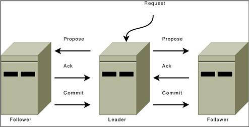

### zookeeper内部系统

#### 原子广播

zk的心跳信息是一个原子的消息系统,这个消息系统保持了所有服务器处于同步状态.

##### 保证,配置和定义

zk的消息系统提供特殊的保证:

+ 可靠的传输

  如果消息`m`使用一个服务器传输,消息`m`会被传递到所有服务器

+ 全局有序

  如果消息`a`在消息`b`之前被发送,那么消息`a`的顺序一直会在消息`b`之前.（FIFO）

  cyclicBarrier

  1-10

  FIFO 10进程的有序性

  1-10 11-20 

  Barrier进行控制

+ 发送的有序性

  如果消息b在消息a之后由发送器b发送出去.那么消息a一定在消息b之前.如果发送器在发送b之后发送c,那么c必须在b之后

zk消息系统需要是高效的,可信的,且易于实现和维护.需要对消息系统能够每秒处理大量数据.尽管需要k+1台服务器发送新的消息,必须可以从失败中恢复过来.

**系统实现**

实现系统的时候,需要很少的一段时间和少量的系统资源.所以需要设置系统设计者可以获取得到的协议.

协议假定可以构造服务器之间是**点对点的FIFO通道**.相似的服务通常假定消息传输时可以丢失和重排序的,假定FIFO通道类似TCP.需要TCP的下述属性:

+ 排序传输

  数据传输时的顺序与数据传入的顺序一致.

+ 关闭之后没有消息

  一旦FIFO通道关闭,就不能再接收到消息

FLP证明了如果在异步的分布式系统中发送了失败,不能够保证数据的一致性.

为了保证数据的一致性,使用了传输延时参数.但是依靠生存时间并不是为了其能够执行成功.因此如果延时参数不能正常工作(时钟不能正常工作),消息系统会挂起.

描述zk消息协议的时候,数据包,传输方案和消息的定义:

+ 数据包

  通过FIFO通道的字节列表

+  基本单位(Proposal)

  一致性参数(Agreement)的基本单位,这个参数主要是通过交换zk服务器的quorum完成.大多数proposal中包含消息,但是新leader的proposal是不包含消息的典型例子.

+ 消息

  原子广播到zk服务器中的字节列表.消息放置到proposal中,且传递是通过Agreement交换

zk可以保证消息的全局顺序,也能够保证proposal的全局顺序.zk使用zk事务id(zxid)暴露全局顺序.所有proposal会使用zxid标记.当quorum识别到这个proposal的时候会发送到所有zk服务器上且提交.

这个识别意味着服务器记录proposal到持久化存储器上.且quorum中一对quorum至少有一个是可以使用的.保证至少(n/2+1)个quorum处于运行状态.

zxid中包含两个部分,**界限点**和**计数器**.在实现中zxid是一个64位的数.保证高32位是**界线点**,低32位是**计数器**.因此zxid可以代表元组(epoch,count)的信息.**界限点**参数代表了选举关系的变化,每次新的leader形成的时候,就会拥有自己的**界线点**(epoch)参数.因此使用简单的算法,去指定唯一的zxid:

leader简单的增加zxid,用于获取每个proposal的位置zxid.**选举激活**会保证仅仅leader会使用指定的**界线点**,所以简单算法可以保证全局唯一的zxid.

zk消息包含两个部分:

+ leader激活

  leader完成系统的正确状态,并准备开始发送proposal

+ 消息激活

  leader接受消息,用于对于消息发送做出指导

zk是一个整体性的协议,不会在意个别的proposal.而是将proposal流看做一个整体.严格的顺序保证可以高效的实现,且大幅度的简化协议leader激活可以表达出全局性协议的概念.当follower和leader进行同步之后,leader就激活了/且持有相同的状态.这个状态包含所有的proposal,leader相信这些proposal已经提交,且需要跟随leader.

#### leader激活

leader激活包含了leader选举(`FastLeaderElection`).zk消息不会在意选举leader的具体方法.只需要遵守如下规则即可:

+ leader可以找到最大zxid对应的follower
+ quorum服务器已经提交,用于跟随leader

只有满足这两个条件,最大zxid需要持有正确的操作.第二个需求,follower的quorum仅仅需要大概率的保证即可.需要重新检测第二个条件,如果leader选举之后出现了异常,并且quorum丢失,通过抛弃leader激活状态,并且启动另一个选举来恢复.

leader选举之后,一个服务器会当做leader启动,等待follower的连接.剩余的服务器会尝试连接leader.

leader通过发送proposal给follower进行同步,如果follower丢失大量proposal,就会发送完整的快照给follower.

存在下述的边界情况,一个follower持有proposal`U`.leader到达的时候不可见.由于proposal是按照顺序排序的,所以U的proposal的zxid大于其他follower的.follower必须在选举之后才能出现,否则如果持有更高的zxid,这个follower可能被选举成leader.

由于提交的proposal必须被服务器quorum发现,选举成leader的quorum没有发现U,所以U的proposal没有提交,所以被弃用了.

当follower连接到leader的时候,leader会告知U已经被抛弃了.

通过获取新的**分界点**(epoch),新的leader完成zxid,用于启动新的proposal的使用.

> 较高的zxid被发现且跳转到下一个zxid,即(e+1,0).
>
> leader同步完follower之后,会产生**新增leader**的proposal.
>
> 一旦的**新增leader**被提交,leader会激活且开始接受和处理proposal.

这个听起来挺复杂的,但是激活期间只需要遵守如下基本规则即可:

+ follower在同步完leader之后,需要回应**新建Leader**(NEW_LEADER)的proposal
+ 使用单台服务器的给定zxid.follower会回应**新建leader(NEW_LEADER)**的proposal
+ 一个新的leader在follower响应之后提交**新建leader**的proposal
+ **新建leader**请求提交之后，一个follower会提交从leader传递过来的状态

* 在新建leader请求被提交之前，新的leader不会接受新的proposal

如果leader选举由于失败终止，因为leader没有quorum的原因,新建leader的proposal不会提交,所以不会存在问题.如果发生了这种情况其他follower和leader会超时并返回leader选举.

#### 消息激活

leader激活进行了所有重操作,一旦选举处理leader就会开始处理proposal.只要保留了leader,其他leader就不会出现,因为其他leader没办法持有follower的quorum信息.

如果一个leader出现了,意味着leader丢失了quorum,且新的leader会清除剩余的信息.

zk消息操作类似于典型的双向提交.



所以消息通道都是FIFO的,所以都是按照顺序处理的.尤其是下述操作:

+ leader发送proposal给所有follower,使用相同的顺序,除此之外,这个顺序遵循请求接受的顺序,因为使用了FIFO通道,所以意味着接受的时候也是按照顺序的.
+ follower按照接受顺序处理消息,这个意味着回复消息也是按照顺序的.且leader接受响应也是按照顺序的.由于使用的是FIFO通道,所以保证会写入到可靠存储中,所有消息都会写到可靠存储中.
+ 一旦follower的quorum响应了一条消息之后,leader会发起提交给所有的follower.由于响应是按照顺序处理的.提交发送顺序也是有序的.
+ 提交按照顺序处理,follower会在proposal提交的时候发送proposal消息.

#### 总结

下面处理其工作原理,为什么受到leader信任的proposal集合总是包含提交的proposal的原因.

首先,所有proposal都有唯一的zxid,与其他协议不同的是,从来不需要担心不同的两个值被同一个zxid处理.

follower顺序地观察和记录proposal,proposal按照顺序提交,同一时刻只有一个激活的leader.(因为其具有最大zxid特征的原因).

一个新的leader会从之前的分界点信息中观测到所有提交的proposal信息,任何之前分界点中未提交的proposal会被新的leader观测到,并提交.

#### 比较(与多重Paxos)

多重Paxos需要保证是单个协调者的措施.不需要再这种断言下进行计数.相反使用了leader激活去恢复leader关系的改变或者是旧的leader确信其处于激活状态.

但是也不像Paxos,因为激活消息的时候使用了双向提交.确实对于我们来说,双向提交消息,且不需要处理消息抛弃的情况.消息的激活不同于proposal的交叉排序.如果没有保证数据包严格的FIFO性质,就不能保障顺序.

同样的,选举激活不同于paxos,特别地,使用分界点(epoch)用于跳过未提交的proposal,且不需要担心proposal的重复.

#### 一致性保证

zk的一致性包含连续一致性和线性一致性.指令会解释额外的zk一致性保证方法.

zk写操作是线性化的,换句话说,每个写操作会原子性的影响客户端提交和接受请求.这意味着所有zk客户端的写操作可以根据写的实时顺序进行排序.但是很少去讨论线性一致性,只有在使用读取操作的时候,才会涉及到这个参数.

zk中的读取操作不是线性一致性的,因为可以返回旧的数据.因为读取操作在zk中不是quorum操作,且服务器会立即响应客户端的读取操作.zk这个做是为了提升读取性能.

但是zk的读取操作是连续一致性的,因为读取操作会在客户端操作中影响序列顺序.正常方式是除了读取操作时使用同步措施.这个也没有严格保证数据实时更新,因为同步也不是一个quorum操作.

总体来说,zk一致性的保证使用osc保证.这个处于连续一致性和线性一致性之间.

#### Quorums

原子广播和leader选举使用quorum去保证系统的一致性,默认情况下zk使用大量的quorum.意味着每次投票发生在这些协议中,所以需要大量的quorum支持.

典型的例子就是一个leader发生proposal,leader可以在接收端服务器quorums响应信息的情况下提交.

如果需要获取需要的属性,只需要保证进程组通过投票来验证操作.但是可以通过其他方式构建大量的quorums.

例如可以指定投票服务器的权重,也就是说一些服务器的权重比较高.为了获取quorum,需要获取足够的支持,以便于获取大于半数的支持.

另一种构造方式使用权重,且广泛使用与分层架构中.使用这种方式,将服务器分层多个不相交的组,且分配每组的权限,为了构建一个quorum,需要获取组G足够的支持(满足半数要求).

#### 日志系统

zk使用slf4j用于日志系统的抽象层.最终使用了log4j 1.2版本作为最终实现.

为了获取更好的嵌入式支持,对于终端用于将来的版本运行日志实现的选择.

因此,,使用slf4j的api配置日志写出功能,而不是配置log4j.

注意slf4j没有fatal等级,,fatal级别的信息会被移动到error等级.

##### 在正确等级进行日志处理

slf4j中有多个日志等级

+ ERROR等级: 错误事件,但是可以允许任务继续执行
+ WARN等级: 可能有害的情况
+ INFO等级: 提示信息
+ DEBUG等级: 用于调试应用的信息
+ TRACE等级: 栈追踪信息

##### 标准slf4j的使用

静态消息日志

```shell
LOG.debug("process completed successfully!");
```


```shell
LOG.debug("got {} messages in {} minutes",new Object[]{count,time});
```

Logger需要使用之后才能进行记录

    public class Foo {
        private static final Logger LOG = LoggerFactory.getLogger(Foo.class);
        ....
        public Foo() {
            LOG.info("constructing Foo");

异常处理

    try {
        // code
    } catch (XYZException e) {
        // do this
        LOG.error("Something bad happened", e);
        // don't do this (generally)
        // LOG.error(e);
        // why? because "don't do" case hides the stack trace
    
        // continue process here as you need... recover or (re)throw
    }
